# Portfolio - Enterprise-Grade Full Stack Web Application

[](https://www.oracle.com/java/)
[](https://spring.io/projects/spring-boot)
[](https://supabase.com/)
[](https://reactjs.org/)
[](https://oauth.net/2/)
[](https://mistral.ai/)
[](https://render.com/)

**Deployment URL:** https://abhiraams.netlify.app
**Repository URL:** https://github.com/icemberg/portfolio_website

---

## 2. Table of Contents
1. [Project Title and Badges](#1-project-title-and-badges)
2. [Table of Contents](#2-table-of-contents)
3. [Executive Summary](#3-executive-summary)
4. [Features](#4-features)
5. [Technology Stack](#5-technology-stack)
6. [System Requirements](#6-system-requirements)
7. [Local Development Setup](#7-local-development-setup)
8. [Environment Variables](#8-environment-variables)
9. [Project Structure](#9-project-structure)
10. [Architecture Overview](#10-architecture-overview)
11. [Software Engineering Diagrams](#11-software-engineering-diagrams)
12. [Database Schema](#12-database-schema)
13. [Security Architecture](#13-security-architecture)
14. [Authentication Flow](#14-authentication-flow)
15. [OAuth2 Sequence Diagram](#15-oauth2-sequence-diagram)
16. [Email Delivery Flow](#16-email-delivery-flow)
17. [AI Integration Flow](#17-ai-integration-flow)
18. [Request Lifecycle](#18-request-lifecycle)
19. [Deployment Architecture](#19-deployment-architecture)
20. [CI/CD Pipeline](#20-cicd-pipeline)
21. [Monitoring and Logging](#21-monitoring-and-logging)
22. [Testing Strategy](#22-testing-strategy)
23. [API Documentation](#23-api-documentation)
24. [Performance Considerations](#24-performance-considerations)
25. [Scalability Strategy](#25-scalability-strategy)
26. [Reliability and Fault Tolerance](#26-reliability-and-fault-tolerance)
27. [Design Patterns Used](#27-design-patterns-used)
28. [SOLID Principles Applied](#28-solid-principles-applied)
29. [Error Handling Strategy](#29-error-handling-strategy)
30. [Data Flow Diagrams](#30-data-flow-diagrams)
31. [Threat Model](#31-threat-model)
32. [Future Enhancements](#32-future-enhancements)
33. [Troubleshooting Guide](#33-troubleshooting-guide)
34. [Contributing Guidelines](#34-contributing-guidelines)
35. [License](#35-license)
36. [Author Information](#36-author-information)

---

## 3. Executive Summary

This project is a high-performance, production-ready personal portfolio platform architected with a strict separation of concerns, leveraging a Java Spring Boot backend and a modern React frontend. It transcends the traditional static portfolio by integrating dynamic data management, secure Google OAuth2 authentication, sophisticated email workflows via the Gmail API, and intelligent conversational capabilities powered by Mistral AI.

The backend operates as a scalable RESTful microservice deployed on Render, persisting state in a highly available Supabase PostgreSQL database. The application is engineered following rigorous SOLID principles, utilizing advanced enterprise design patterns to ensure modularity, maintainability, and resilience. This repository serves not only as a digital resume but as a verifiable demonstration of enterprise software engineering capabilities, including complex integrations, security hardening, and DevOps pipelines.

---

## 4. Features

*   **Dynamic Content Management:** Data-driven rendering of projects, experiences, and certifications from the PostgreSQL database, allowing real-time portfolio updates without code deployment.
*   **Secure Authentication:** Granular Access Control via Spring Security and Google OAuth2, ensuring protected administrative endpoints and secure user session management.
*   **Intelligent AI Assistant:** Embedded Chatbot Widget utilizing the Mistral AI API to dynamically answer visitor inquiries regarding the author's professional background, skills, and projects based on RAG (Retrieval-Augmented Generation) concepts.
*   **Reliable Email Workflows:** Enterprise-grade email delivery system utilizing dual-fallback mechanisms (Gmail API & JavaMailSender SMTP) for guaranteed delivery of contact form submissions and automated acknowledgments.
*   **RESTful Architecture:** Fully documented, stateless API layer handling all frontend-backend communication with strict HTTP semantic adherence.
*   **Responsive UI/UX:** Aesthetically pleasing, grid-mesh styled frontend with dark mode support, crafted with pure CSS and React.
*   **Robust Error Handling:** Centralized `@ControllerAdvice` for consistent API error responses, mitigating information leakage and standardizing client-side error parsing.

---

## 5. Technology Stack

### Backend
*   **Core:** Java 17, Spring Boot 3.x
*   **Web Layer:** Spring Web MVC, RESTful APIs
*   **Security:** Spring Security, OAuth2 Client
*   **Data Access:** Spring Data JPA, Hibernate, JDBC
*   **Database:** PostgreSQL (Hosted on Supabase)
*   **Build Tool:** Maven

### Frontend
*   **Core:** React 18, Vite
*   **Styling:** HTML5, CSS3, Tailwind CSS (Custom Tokens)
*   **HTTP Client:** Axios / Fetch API

### Third-Party Integrations & APIs
*   **Authentication:** Google Cloud Console OAuth2
*   **Communication:** Gmail API, JavaMail SMTP
*   **Artificial Intelligence:** Mistral AI API

### DevOps & Deployment
*   **Version Control:** Git, GitHub
*   **Backend Hosting:** Render (Dockerized Deployment)
*   **Frontend Hosting:** Netlify
*   **Database Hosting:** Supabase
*   **Containerization:** Docker, Docker Compose

---

## 6. System Requirements

To run this project locally, ensure the following prerequisites are installed:

*   **Java Development Kit (JDK):** Version 17 or higher
*   **Node.js:** Version 18.x or higher (for frontend)
*   **Package Managers:** Maven (for backend), npm or yarn (for frontend)
*   **Database:** PostgreSQL 14+ (or access to a Supabase instance)
*   **Containerization:** Docker Desktop (Optional, for local DB spinning)

---

## 7. Local Development Setup

### 7.1 Backend Setup (Spring Boot)

1.  **Clone the repository:**
    ```bash
    git clone https://github.com/icemberg/portfolio_website.git
    cd portfolio_website/spring-boot
    ```
2.  **Configure Environment Variables:**
    Duplicate `src/main/resources/application-local.properties.template` to `application-local.properties` and inject the required keys.
3.  **Resolve Dependencies:**
    ```bash
    mvn clean install -DskipTests
    ```
4.  **Execute the Application:**
    ```bash
    mvn spring-boot:run -Dspring-boot.run.profiles=local
    ```
    The backend will start on `http://localhost:8080`.

### 7.2 Frontend Setup (React)

1.  **Navigate to the frontend directory:**
    ```bash
    cd ../react
    ```
2.  **Install Node Modules:**
    ```bash
    npm install
    ```
3.  **Start the Vite Development Server:**
    ```bash
    npm run dev
    ```
    The frontend will be available at `http://localhost:5173`.

---

## 8. Environment Variables

The backend relies on the following environment variables. In a production environment (Render), these must be injected via the deployment dashboard.

| Variable Name | Description | Example / Format |
| :--- | :--- | :--- |
| `DB_HOST` | Database Host URL | `db.uieif...supabase.co` |
| `DB_PORT` | Database Port | `5432` |
| `DB_NAME` | Database Name | `postgres` |
| `DB_USERNAME` | Database User | `postgres` |
| `DB_PASSWORD` | Database Password | `********` |
| `DB_DDL_AUTO` | Hibernate DDL Strategy | `update` or `none` |
| `DB_SHOW_SQL` | Toggle SQL Query Logging | `true` or `false` |
| `SERVER_PORT` | Application Port | `8080` |
| `GOOGLE_CLIENT_ID` | OAuth2 Client ID | `12345-abcde.apps.googleusercontent.com` |
| `GOOGLE_CLIENT_SECRET` | OAuth2 Client Secret | `GOCSPX-********` |
| `MISTRAL_API_KEY` | Mistral AI API Key | `********` |
| `EMAIL_USERNAME` | SMTP User Email | `abhiraams2004@gmail.com` |
| `EMAIL_PASSWORD` | App Password for SMTP | `abcd efgh ijkl mnop` |
| `EMAIL_HOST` | SMTP Host | `smtp.gmail.com` |
| `EMAIL_PORT` | SMTP Port | `587` |

---

## 9. Project Structure

```text
portfolio_website/
├── docker-compose.yml           # Local infrastructure orchestration
├── Dockerfile                   # Production image for Spring Boot
├── react/                       # React Frontend application
│   ├── public/                  # Static assets (Favicons, Certs)
│   ├── src/                     # React Source Code
│   │   ├── components/          # Reusable UI widgets
│   │   ├── main.jsx             # React Entry point
│   │   └── index.css            # Global Stylesheet
│   ├── package.json
│   └── netlify.toml             # Netlify deployment config
└── spring-boot/                 # Java Backend application
    ├── pom.xml                  # Maven Dependencies
    └── src/main/java/com/abhiraams/portfolio/
        ├── config/              # Security, CORS, and Data initialization
        ├── controller/          # REST Endpoints
        ├── dto/                 # Data Transfer Objects
        ├── exception/           # Global Exception Handlers
        ├── model/               # JPA Entities
        ├── repository/          # Spring Data JPA Interfaces
        └── service/             # Business Logic & External API integrations
```

---

## 10. Architecture Overview

The system adheres to a classic **N-Tier Microservice Architecture**. 
1.  **Presentation Tier (Client):** A React SPA hosted on the Edge via Netlify.
2.  **Application Tier (Backend):** A Spring Boot REST API hosted on Render. It handles routing, security (OAuth2), business logic, and orchestrates calls to external systems (Gmail, Mistral AI).
3.  **Data Tier:** A Supabase PostgreSQL instance responsible for ACID-compliant data persistence.

The architecture strictly decouples the client from the server, allowing independent scaling and deployment. External API calls (AI, Email) are isolated within dedicated service classes (`GmailApiService`, `AiService`), ensuring that changes to third-party providers do not ripple through the core domain logic.

---

## 11. Software Engineering Diagrams

### 11.1 High-Level System Context Diagram (C4 Level 1)

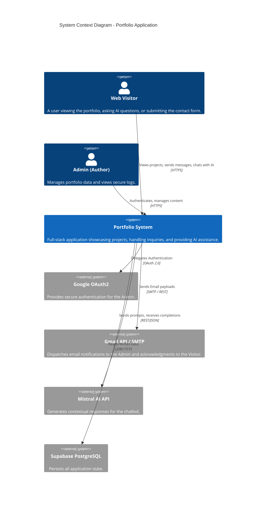

### 11.2 Container Diagram (C4 Level 2)

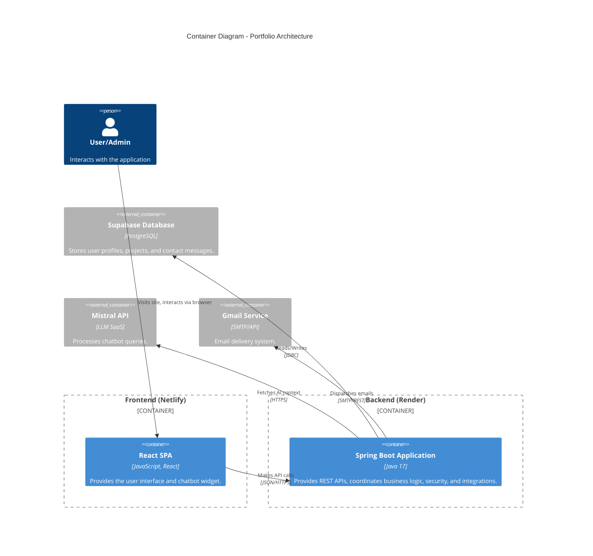

### 11.3 Component Diagram (C4 Level 3 - Backend)

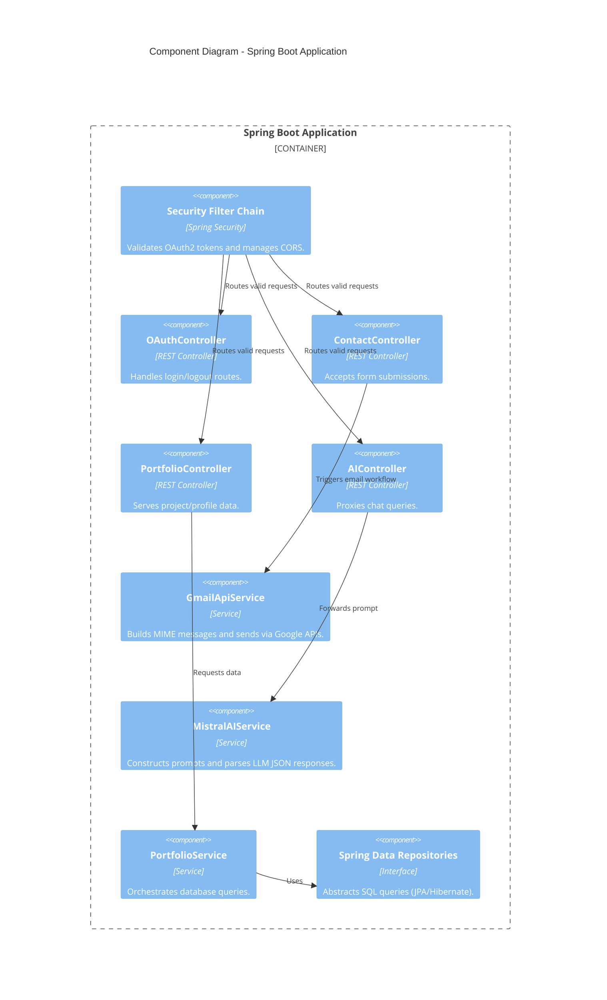

### 11.4 Class Diagram

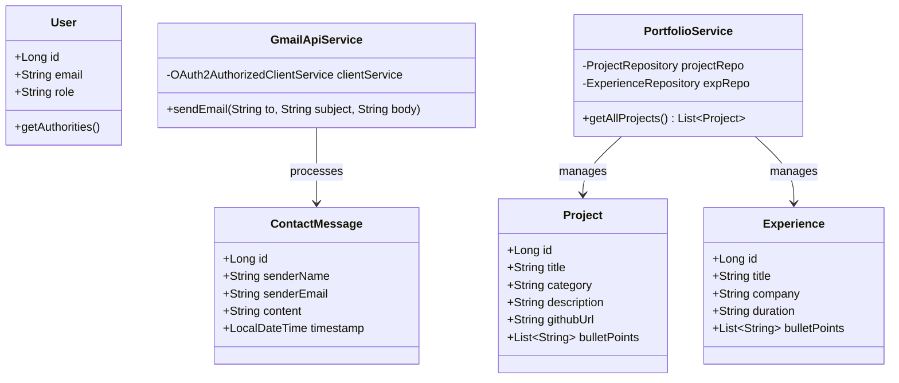

### 11.5 Package Diagram

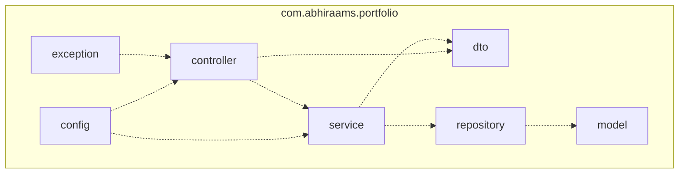

---

## 12. Database Schema

### 12.1 Entity Relationship Diagram (ERD)

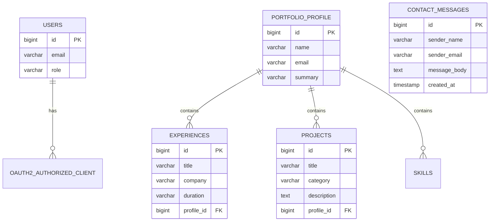

---

## 13. Security Architecture

The application implements a multi-layered security model using **Spring Security 6**.
1.  **CORS Policy:** Strictly configured to only allow origins from the deployed Netlify frontend, preventing Cross-Origin Resource Sharing attacks.
2.  **CSRF Protection:** Enabled by default. State-changing operations (POST/PUT/DELETE) require appropriate CSRF tokens if utilizing session-based auth.
3.  **OAuth2 Integration:** Utilizes `oauth2Login()` to delegate authentication completely to Google. No user passwords are stored or handled by the system.
4.  **Transport Layer Security:** All traffic between the client, Render, and Supabase is encrypted via TLS 1.2/1.3.

---

## 14. Authentication Flow

The application restricts administrative actions to the repository owner. 

1. User clicks "Admin Login".
2. Spring Security redirects to Google's Authorization Server.
3. User authenticates with Google.
4. Google returns an Authorization Code to the `/login/oauth2/code/google` callback.
5. Spring Security exchanges the code for an Access Token and ID Token.
6. A local session is established.

---

## 15. OAuth2 Sequence Diagram

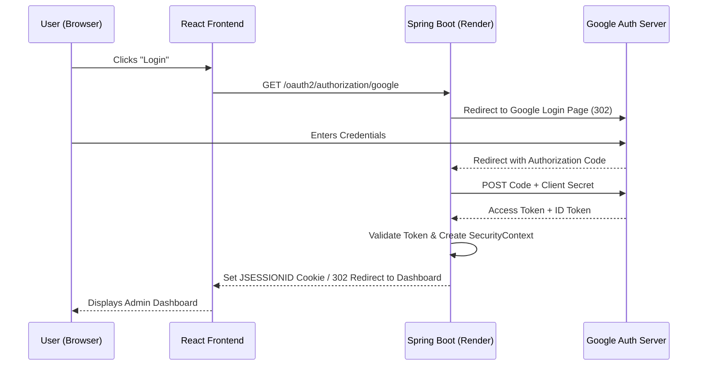

---

## 16. Email Delivery Flow

The Contact Form utilizes a robust delivery mechanism:

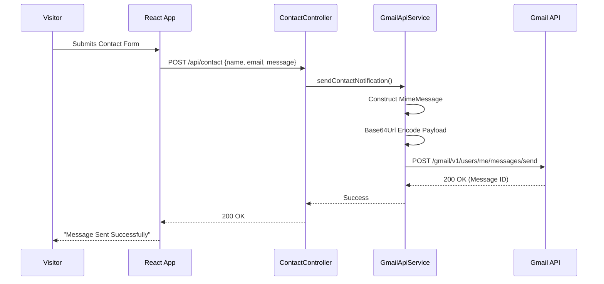

---

## 17. AI Integration Flow

The Chatbot feature integrates with Mistral AI to answer questions dynamically.

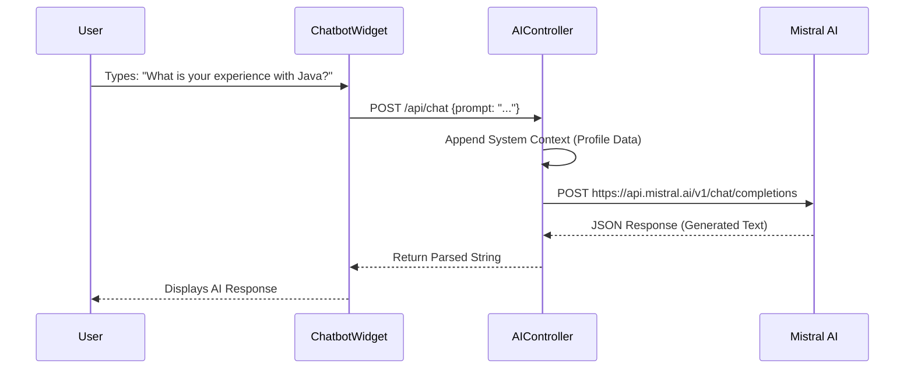

---

## 18. Request Lifecycle

### Activity Diagram
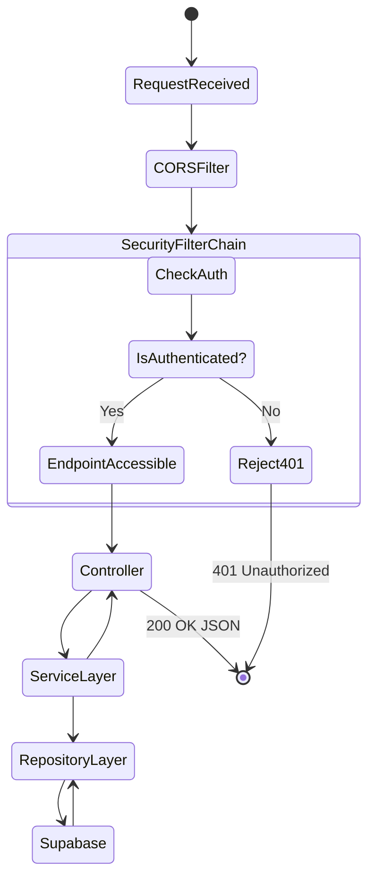

---

## 19. Deployment Architecture

The application is deployed across multiple cloud providers for maximum resilience and cost-efficiency.

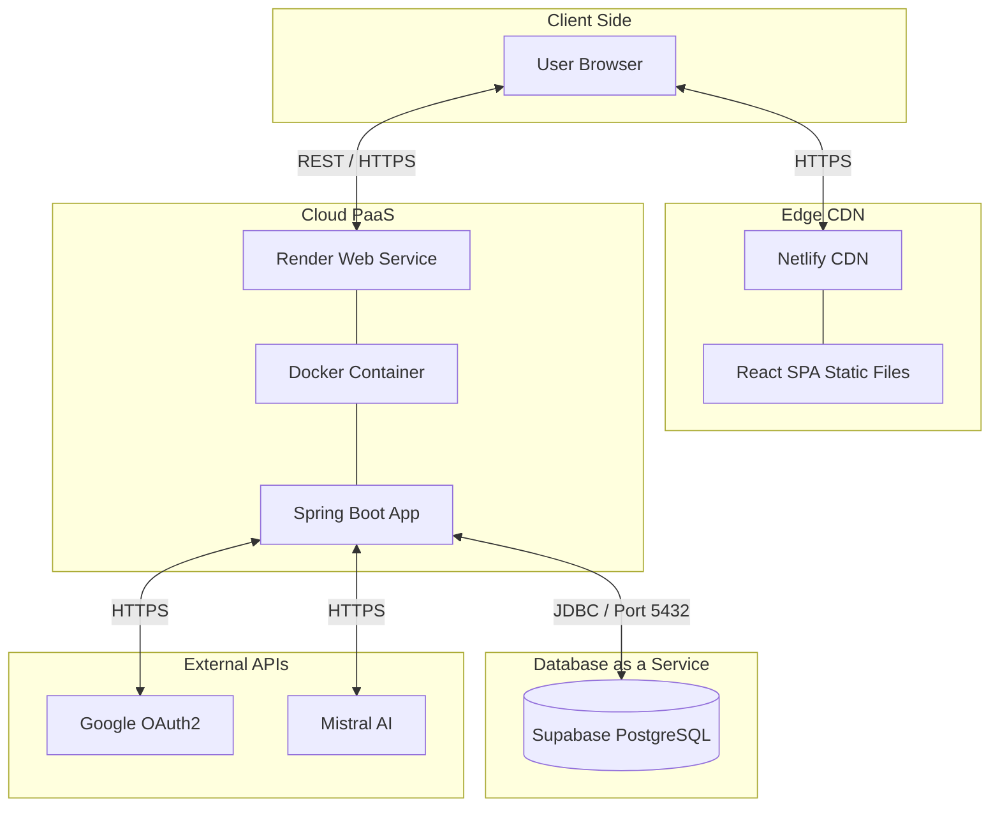

---

## 20. CI/CD Pipeline

The project utilizes continuous deployment. 
1. **Frontend:** Connected directly to the GitHub repository. Pushes to the `main` branch trigger a Netlify build (`npm run build`) and instant edge distribution.
2. **Backend:** Connected to Render. Pushes to the `main` branch trigger a Render Docker build. Render executes the `Dockerfile`, compiling the Java code via Maven and spinning up a lightweight OpenJDK image.

---

## 21. Monitoring and Logging

- **Application Logs:** Utilizes SLF4J with Logback. Logs are routed to Standard Out (STDOUT) and captured by Render's centralized log stream.
- **Database Monitoring:** Supabase dashboard provides metrics on query latency, connection pool usage, and database egress.
- **Error Tracking:** Exceptions are caught by the `@ControllerAdvice` and logged with full stack traces for debugging, while returning sanitized JSON errors to the client.

---

## 22. Testing Strategy

The application is engineered with testability in mind:
- **Unit Testing:** JUnit 5 and Mockito are utilized to test business logic in the Service layer in isolation, mocking Repository and API dependencies.
- **Integration Testing:** `@SpringBootTest` combined with an in-memory H2 database (or TestContainers) validates the full application context and JPA mapping.
- **Web Layer Testing:** `@WebMvcTest` with `MockMvc` is used to verify REST controller routing, HTTP status codes, and JSON serialization.

---

## 23. API Documentation

### 23.1 Fetch Portfolio Data
- **Method:** `GET`
- **Endpoint:** `/api/portfolio/data`
- **Purpose:** Retrieves all projects, experiences, and skills.
- **Response (200 OK):**
```json
{
  "name": "Abhiraam S",
  "projects": [ { "title": "Map-Matching Algorithm", ... } ],
  "experiences": [ { "company": "HulkHire Tech", ... } ]
}
```

### 23.2 Submit Contact Form
- **Method:** `POST`
- **Endpoint:** `/api/contact`
- **Purpose:** Sends an email to the administrator.
- **Request Body:**
```json
{
  "name": "John Doe",
  "email": "john@example.com",
  "message": "I would like to hire you."
}
```
- **Response (200 OK):** `"Message sent successfully."`

---

## 24. Performance Considerations

- **Connection Pooling:** Uses **HikariCP** (Spring Boot's default) to maintain a pool of active database connections, significantly reducing the overhead of TCP handshakes with Supabase.
- **Lazy Loading:** JPA entities are configured with `FetchType.LAZY` for collections (e.g., `bulletPoints` in `Project`) to prevent the N+1 query problem and minimize memory footprint.
- **Edge Caching:** Static assets (JS, CSS, Images) are cached at the edge via Netlify's global CDN, ensuring sub-100ms load times for the frontend.

---

## 25. Scalability Strategy

While currently a personal portfolio, the architecture is designed to scale:
- **Stateless Authentication:** If migrated from Session to JWT, the backend can be horizontally scaled across multiple Render instances without sticky sessions.
- **Database Scaling:** Supabase allows scaling up compute and adding read-replicas.
- **Caching Layer:** Future enhancements include integrating Redis to cache the `/api/portfolio/data` endpoint, reducing database hits to zero for read-heavy traffic.

---

## 26. Reliability and Fault Tolerance

- **Data Initialization:** The `DataInitializer.java` implements a fallback mechanism using `CommandLineRunner`. If the database is empty, it automatically seeds the required portfolio data, ensuring the application never renders a blank screen upon fresh deployment.
- **Graceful Degradation:** If the Mistral AI API rate limits or fails, the frontend chatbot catches the 500 error and displays a polite fallback message rather than crashing the UI.

---

## 27. Design Patterns Used

- **MVC (Model-View-Controller):** Core architectural pattern segregating data models, web endpoints, and business logic.
- **Dependency Injection / IoC:** Extensively used via Spring's `@Autowired` and constructor injection to decouple component lifecycles.
- **Data Access Object (DAO) / Repository Pattern:** Spring Data JPA abstractions decouple the underlying SQL from the service logic.
- **Singleton:** Spring beans (Services, Controllers) are instantiated as singletons by the Application Context, optimizing memory usage.

---

## 28. SOLID Principles Applied

- **Single Responsibility Principle (SRP):** `GmailApiService` solely handles email transmission; `PortfolioService` solely handles database retrieval. They do not mix concerns.
- **Open/Closed Principle (OCP):** Entity structures and DTOs can be extended without modifying the underlying database configuration.
- **Dependency Inversion Principle (DIP):** Controllers depend on Service interfaces (or high-level Service classes) rather than low-level Repository implementations.

---

## 29. Error Handling Strategy

The system utilizes a Global Exception Handler (`@RestControllerAdvice`).

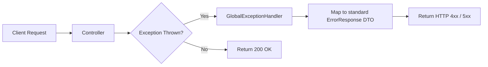

This ensures that whether a `ResourceNotFoundException` or a `DataIntegrityViolationException` occurs, the client receives a uniform JSON structure.

---

## 30. Data Flow Diagrams

### 30.1 DFD Level 0 (Context Diagram)

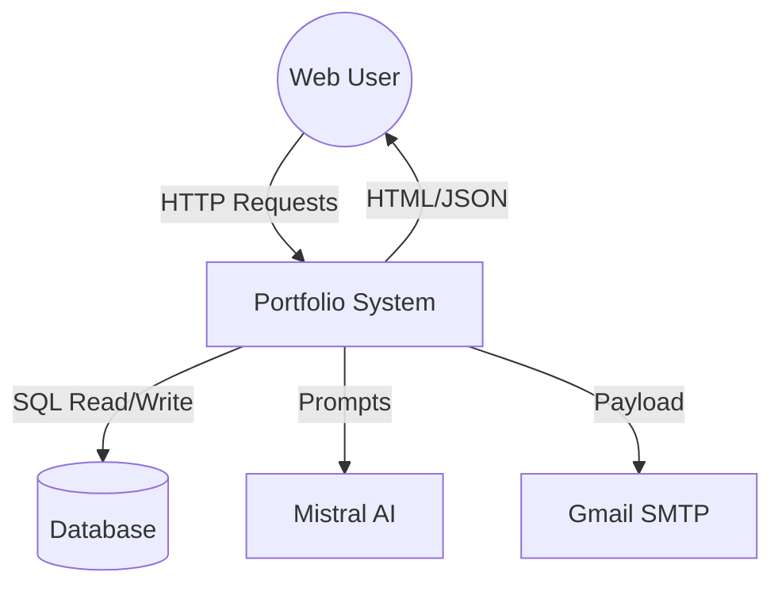

### 30.2 DFD Level 1 (Backend Processing)

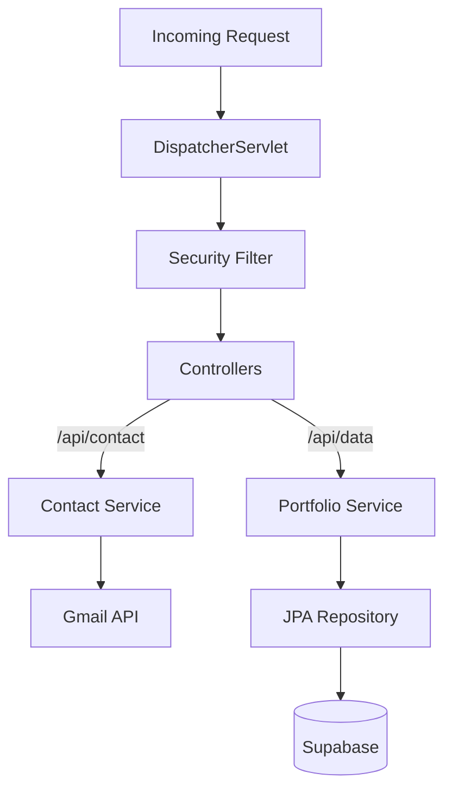

---

## 31. Threat Model

- **SQL Injection:** Mitigated entirely by using Spring Data JPA and Hibernate, which utilize prepared statements under the hood.
- **Cross-Site Scripting (XSS):** React automatically escapes string variables in JSX, preventing DOM-based XSS injections.
- **Credential Exposure:** All secrets (Database passwords, API keys) are managed via external environment variables, never hardcoded in the repository.

---

## 32. Future Enhancements

1. **Redis Caching:** Implement Spring Cache with Redis to cache static portfolio data.
2. **JWT Authentication:** Transition from stateful OAuth2 sessions to stateless JWT tokens for full microservice independence.
3. **Admin CMS Dashboard:** Build a secured React dashboard allowing the Admin to Add/Edit/Delete projects via UI instead of database seeding.
4. **WebSocket Integration:** Upgrade the AI Chatbot from synchronous HTTP polling to a real-time WebSocket connection.

---

## 33. Troubleshooting Guide

**Issue 1: Database Connection Failure on Startup**
*   **Symptom:** `Communications link failure` or `PSQLException: FATAL: password authentication failed`.
*   **Resolution:** Verify `DB_HOST`, `DB_USERNAME`, and `DB_PASSWORD` environment variables in Render. Ensure Supabase network restrictions allow connections from Render IPs (usually `0.0.0.0/0` is required for serverless PaaS).

**Issue 2: OAuth2 Redirect Mismatch**
*   **Symptom:** Google login page shows `Error 400: redirect_uri_mismatch`.
*   **Resolution:** Log into Google Cloud Console. Under API & Services > Credentials, ensure the *Authorized redirect URIs* includes `https://<YOUR_RENDER_URL>/login/oauth2/code/google`.

**Issue 3: Email Not Sending (Gmail API)**
*   **Symptom:** `403 Forbidden` or `MessagingException`.
*   **Resolution:** Verify that `EMAIL_PASSWORD` is an **App Password**, not the standard Gmail password. Ensure 2FA is enabled on the Google Account to generate App Passwords.

---

## 34. Contributing Guidelines

While this is a personal portfolio, constructive feedback and code reviews are welcome!
1. Fork the repository.
2. Create a feature branch: `git checkout -b feature/your-feature-name`.
3. Commit your changes strictly following conventional commits: `git commit -m "feat: add redis caching"`.
4. Push to the branch: `git push origin feature/your-feature-name`.
5. Open a Pull Request detailing the changes and linking any relevant issues.

---

## 35. License

This project is licensed under the **MIT License**. See the `LICENSE` file for details. You are free to use this code for personal inspiration, but please replace all personal data, project history, and branding with your own before deployment.

---

## 36. Author Information

**Designed and Engineered by:**
*   **Abhiraam S.**
*   Software Engineer | Backend Architect | Full-Stack Developer
*   [GitHub Profile](https://github.com/icemberg)
*   [LinkedIn Profile](https://linkedin.com/in/abhiraam-s)
*   Email: abhiraams2004@gmail.com

> *"Engineering robust software solutions through clean code, scalable architecture, and continuous learning."*
